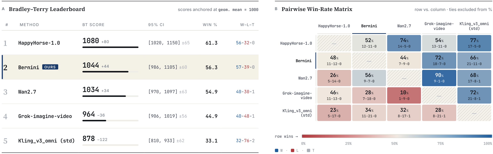

<div align="center">


#### Latent Semantic Planning for Video Diffusion

**Chenchen Liu<sup>\*</sup>, Junyi Chen<sup>\*</sup>, Lei Li<sup>\*</sup>, Lu Chi<sup>\*,§</sup>, Mingzhen Sun<sup>\*</sup>, Zhuoying Li<sup>\*</sup>, Yi Fu, Ruoyu Guo, Yiheng Wu, Ge Bai, Zehuan Yuan<sup>✉</sup>**

<sup>\*</sup> Equal contribution&nbsp;&nbsp;<sup>✉</sup> Corresponding author&nbsp;&nbsp;<sup>§</sup> Project lead

[](https://arxiv.org/abs/2605.22344)
[](https://bernini-ai.github.io/)
[](https://huggingface.co/ByteDance/Bernini)

</div>

## 🎉 News

- **[2026-06-01]** We open-sourced the inference code and model weights of the Bernini Renderer (**Bernini-R**).
- **[2026-05-22]** We released our paper [Bernini: Latent Semantic Planning for Video Diffusion](https://arxiv.org/abs/2605.22344).

## ✨ Highlights

Bernini is a unified framework for video generation and editing that combines an MLLM-based semantic planner with a DiT-based renderer.

On video editing, Bernini reaches the first tier among leading closed-source
commercial models. The leaderboard below comes from our self-built arena
platform, where human annotators blindly vote on paired edits and the votes are
aggregated into a Bradley-Terry score and a pairwise win-rate matrix.



## 📦 Installation

### Requirements

- **Python** 3.11.2.
- **CUDA GPU** — a Hopper GPU (H100/H800/H200) is recommended so FlashAttention-3
  can be used; other CUDA GPUs fall back to FlashAttention-2 or PyTorch SDPA.
- **CUDA toolkit** 12.4 (matches the pinned `torch==2.5.1+cu124`; 12.3+ is the
  minimum if you build FlashAttention-3).
- Pinned in `requirements.txt`: `torch==2.5.1+cu124`, `diffusers==0.35.2`,
  `accelerate==0.34.2`, `transformers==4.57.3`.

Reference environment (Bernini-R is developed and tested on this setup):

| Component | Version      |
|-----------|--------------|
| GPU       | NVIDIA H100  |
| CUDA      | 12.4         |
| Python    | 3.11.2       |
| PyTorch   | 2.5.1+cu124  |

### Install

```bash
git clone https://github.com/bytedance/Bernini.git bernini && cd bernini
pip install -r requirements.txt
```

Optional extras:

- **Multi-GPU sequence parallel** needs [Open-VeOmni](https://github.com/ByteDance-Seed/VeOmni)
  (Apache-2.0, Python 3.11). Use `--no-deps` so VeOmni does not pull in a
  different torch build and override the pinned `torch==2.5.1+cu124`:
  `pip install --no-deps git+https://github.com/ByteDance-Seed/VeOmni.git@v0.1.10`.
  Single-GPU inference does not need it.
- **Faster attention** (auto-detected if installed; otherwise PyTorch SDPA is used):
  - FlashAttention-2 — general CUDA GPUs (incl. A100/A800): `pip install flash-attn==2.8.3`.
  - FlashAttention-3 — Hopper only (H100/H800/H200, CUDA ≥ 12.3, PyTorch ≥ 2.4).
    `flash_attn_interface` is not on PyPI; build it from the
    [flash-attention](https://github.com/Dao-AILab/flash-attention) repo's
    `hopper/` directory at tag `v2.8.3`:
    ```bash
    git clone https://github.com/Dao-AILab/flash-attention.git
    cd flash-attention && git checkout v2.8.3
    cd hopper && MAX_JOBS=$(nproc) python3 setup.py install --user
    ```

### Weights

Bernini-R uses two sets of weights:

1. **Wan2.2 base** — [`Wan-AI/Wan2.2-T2V-A14B-Diffusers`](https://huggingface.co/Wan-AI/Wan2.2-T2V-A14B-Diffusers) on Hugging Face. Supplies the
   VAE, UMT5 text encoder, tokenizer, and the transformer architecture/base weights.
   It is downloaded automatically on first run (configured by `wan22_base` in
   `configs/bernini_renderer_wan22/config.json`).
2. **Bernini-R checkpoint** — the trained high-noise / low-noise transformer weights
   (safetensors) from [Hugging Face](https://huggingface.co/ByteDance/Bernini), passed with
   `--high_noise_ckpt` / `--low_noise_ckpt`. Both a local directory and a Hugging
   Face repo id are accepted.

Download models using huggingface-cli:

```bash
pip install -U "huggingface_hub"
hf download Wan-AI/Wan2.2-T2V-A14B-Diffusers --local-dir Wan2.2-T2V-A14B-Diffusers
hf download ByteDance/Bernini --local-dir Bernini
```

## 🚀 Usage

A run is described by a **case file** — a small JSON under
[`assets/testcases/`](assets/testcases/) that bundles one task's routing and
inputs (`task_type`, `guidance_mode`, `prompt`, source media, `output`). This
keeps long prompts out of the command line. Each task has a directory under
`assets/testcases/` holding one or more case files; see
[`assets/testcases/`](assets/testcases/) for the format and the bundled
`t2i` / `i2i` / `t2v` / `v2v` / `rv2v` /`r2v` examples.

### Prompt enhancer (recommended)

`--use_pe` enhances the prompt through an OpenAI-compatible endpoint and is
recommended for best generation quality. The `openai` SDK is installed by
`requirements.txt`; configure the endpoint with environment variables:

```bash
export BERNINI_PE_API_KEY=...      # or OPENAI_API_KEY
export BERNINI_PE_BASE_URL=...     # or OPENAI_BASE_URL
export BERNINI_PE_MODEL=...        # vision-capable chat model
```

### Examples by task type

Unless an example specifies otherwise, inference outputs **480p / 16fps** (the
defaults — `--max_image_size 848`, `--fps 16`).

Each example runs a bundled case in
[`assets/testcases/`](assets/testcases/) — replace `<hi>` / `<lo>` with your
high-/low-noise checkpoint paths. The image tasks (`t2i`, `i2i`) are shown on a
single GPU; the video tasks on 8 GPUs via `torchrun`, where `--ulysses N` gives
N-way Ulysses sequence parallel per sample and the remaining `world_size / N`
ranks run data parallel over the task list. The two scripts take the same
inputs, so any example can be run either way.

Inputs can also be passed directly as flags instead of `--case` (`--prompt`,
`--task_type`, `--guidance_mode`, `--video`, `--image`, `--images`,
`--output`); generation parameters (`--seed`, `--num_frames`, ...) are always
command-line flags.

**Text-to-image** (`t2i`) — single GPU; generates one frame, so pass `--num_frames 1`

```bash
python infer_single_gpu.py --high_noise_ckpt <hi> --low_noise_ckpt <lo> \
    --case assets/testcases/t2i/t2i.json --num_frames 1
```

**Image editing** (`i2i`) — single GPU; generates one frame, so pass `--num_frames 1`

```bash
python infer_single_gpu.py --high_noise_ckpt <hi> --low_noise_ckpt <lo> \
    --case assets/testcases/i2i/i2i.json --num_frames 1
```

**Text-to-video** (`t2v`)

```bash
torchrun --nproc-per-node 8 infer_multi_gpu.py \
    --high_noise_ckpt <hi> --low_noise_ckpt <lo> --ulysses 8 \
    --case assets/testcases/t2v/t2v.json
```

**Video editing** (`v2v` / `mv2v`) — two cases are provided.

For edits where the main subject keeps its ordinary motion (case 1 adds a
snowman to the scene), the `v2v` task type is enough:

```bash
torchrun --nproc-per-node 8 infer_multi_gpu.py \
    --high_noise_ckpt <hi> --low_noise_ckpt <lo> --ulysses 8 \
    --case assets/testcases/v2v/v2v_case1.json
```

For edits that need to change the subject's motion (case 2 makes the person
crouch down), the `mv2v` task type gives better results:

```bash
torchrun --nproc-per-node 8 infer_multi_gpu.py \
    --high_noise_ckpt <hi> --low_noise_ckpt <lo> --ulysses 8 \
    --case assets/testcases/v2v/v2v_case2.json
```

**Reference + video editing** (`rv2v`) — two cases are provided.

Case 1 is reference-image-guided video editing — replacing a garment in the
source video with one from a reference image:

```bash
torchrun --nproc-per-node 8 infer_multi_gpu.py \
    --high_noise_ckpt <hi> --low_noise_ckpt <lo> --ulysses 8 \
    --case assets/testcases/rv2v/rv2v_case1.json
```

Case 2 is a video-insertion example — inserting content into the source video.
It is run at 720p / 24fps to show the insertion result more clearly:

```bash
torchrun --nproc-per-node 8 infer_multi_gpu.py \
    --high_noise_ckpt <hi> --low_noise_ckpt <lo> --ulysses 8 \
    --case assets/testcases/rv2v/rv2v_case2.json \
    --num_frames 121 --fps 24 --max_image_size 1280
```

**Reference-to-video** (`r2v`) — drives a video from one or more reference images

```bash
torchrun --nproc-per-node 8 infer_multi_gpu.py \
    --high_noise_ckpt <hi> --low_noise_ckpt <lo> --ulysses 8 \
    --case assets/testcases/r2v/r2v.json
```

See `python infer_single_gpu.py --help` for the full argument list.

### Gradio demo

`gradio_demo.py` exposes the same pipeline through a Gradio UI: the task-type
dropdown auto-fills `guidance_mode` (still user-editable), uploaded media is
routed to the matching slot, and the result is rendered inline.

```bash
# Single GPU
python gradio_demo.py --high_noise_ckpt <hi> --low_noise_ckpt <lo> --port 7860

# 8 GPUs, 8-way Ulysses sequence parallel
torchrun --nproc-per-node 8 gradio_demo.py --ulysses 8 \
    --high_noise_ckpt <hi> --low_noise_ckpt <lo> --port 7860 --share
```

Add `--use_pe` (and `export OPENAI_API_KEY=...` / `BERNINI_PE_API_KEY=...`) to
enable GPT prompt enhancement; the in-UI checkbox is a per-request switch on
top of this flag.

## 📑 Citation

If you use Bernini in your research, please cite:

```bibtex
@article{bernini,
  title   = {Bernini: Latent Semantic Planning for Video Diffusion},
  author  = {Chenchen Liu and Junyi Chen and Lei Li and Lu Chi and Mingzhen Sun and Zhuoying Li and Yi Fu and Ruoyu Guo and Yiheng Wu and Ge Bai and Zehuan Yuan},
  journal = {arXiv preprint arXiv:2605.22344},
  year    = {2026}
}
```

## 🙏 Acknowledgements

Bernini builds on several outstanding open-source projects:

- [Wan2.2-T2V-A14B](https://huggingface.co/Wan-AI/Wan2.2-T2V-A14B)
- [Qwen2.5-VL-7B-Instruct](https://huggingface.co/Qwen/Qwen2.5-VL-7B-Instruct)
- [VeOmni](https://github.com/ByteDance-Seed/VeOmni)

We thank the authors and communities of these projects for their contributions.

## 📄 License

Apache License 2.0. See [LICENSE](LICENSE).
